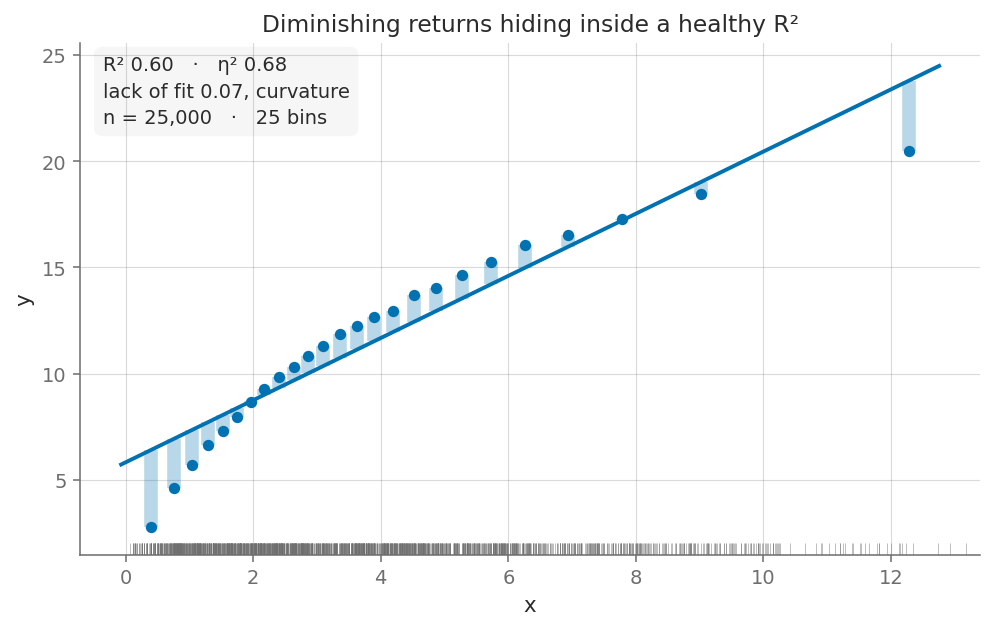

# binspect

**Binned scatterplots that audit the regression behind them.**

`binspect` — *bin* + *inspect* — treats a binned scatterplot as a diagnostic, not a
chart type. Bin `x`, average `y` within each bin, and you have the fitted values of
the saturated model `OLS(y ~ C(bin))`. How far those bin means sit from your fitted
line is how much structure the linear specification is discarding. `binspect` draws
that distance instead of leaving it implicit, in a figure that is already
presentation-ready.



```python
import binspect

bs = binspect.binscatter(df, y="sales", x="age", bins=20)

bs.table  # per-bin means, SDs, standard errors, intervals
print(bs.summary())
bs.plot(theme="paper")
```

## Why another one

| | `binsreg` | `binscatter` | `binspect` |
|---|---|---|---|
| Inference (uniform bands, shape tests) | ✅ authoritative | ✗ | ✗ |
| Publication-ready figure out of the box | ✗ | ✅ | ✅ |
| Tells you whether your linear model fits | ✗ | ✗ | ✅ |

`binsreg` (Cattaneo, Crump, Farrell and Feng) owns the inference theory, and
`binspect` delegates optimal bin selection to it rather than reimplementing it. Use
`binsreg` when you need uniform confidence bands or a formal shape-restriction test.

## What it draws

Every audit quantity has a visual form. If a diagnostic can only be communicated as a
number in a corner, it does not go in the default plot.

| Layer | What it shows | Default |
|---|---|---|
| `bins` | Bin means — the saturated-model fitted values | on |
| `ci` | Confidence bar per bin mean | on |
| `fit` | OLS line through the underlying data | on |
| `deviation` | Shading between bin means and the line — the lack of fit | on |
| `rug` | x-density, so quantile bins can't hide their own imbalance | on |
| `sd_line` | Slope σy/σx — the OLS line is this flattened by `r` | off |
| `smooth` | Local-linear smoother through the bin means | off |
| `raw` | Underlying observations at low alpha | off |

Three themes: `notebook` (default), `paper` (thin, serif, greyscale-safe),
`deck` (heavy marks, legible from the back of a room). All colourblind-safe. Themes
are scoped — importing `binspect` never touches your `rcParams`.

## One thing to know about η²

A common claim is that η² (the bin model's R²) upper-bounds the linear R², so their
difference measures curvature. **That is false**, and there's a test in the suite that
proves it: a step function does not nest a straight line, so with coarse bins η² can
sit well *below* R². `binspect` therefore reports lack of fit,

```
SS_lof = Σⱼ nⱼ (ȳⱼ − ŷ(x̄ⱼ))²      gap = SS_lof / SS_total
```

which is non-negative by construction and is exactly the ink in the deviation layer.
η² is still reported; it just can't be differenced against R².

## Status

Pre-release (`0.1.0.dev0`). Both APIs may change before the first stable release. The
distribution name is `binspect-regression`; the import remains `binspect`.

**Not yet implemented:** covariate adjustment via FWL residualization, cluster-robust
standard errors, uniform confidence bands, and quantile regression. Standard errors are
currently `sd/√n` within bin — correct under independence, wrong for clustered data.

## Install

```bash
git clone https://github.com/joshuamyers22/binspect.git && cd binspect
pip install -e ".[dev]"
pytest
```

Once published, users will install the package with
`pip install binspect-regression` and continue to write `import binspect`.

For contributing, release checks, and development conventions, see
[CONTRIBUTING.md](CONTRIBUTING.md). Please report vulnerabilities privately as
described in [SECURITY.md](SECURITY.md).

## License

MIT.

## Citation

The methodology this package leans on is Cattaneo, M. D., Crump, R. K., Farrell,
M. H., & Feng, Y. (2024). "On Binscatter." *American Economic Review*, 114(5),
1488–1514. If you use binned scatterplots for inference, cite that paper and consider
using `binsreg` directly.
