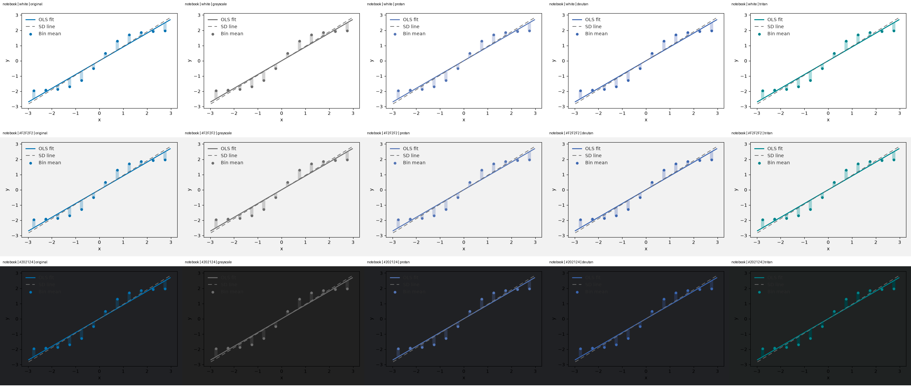
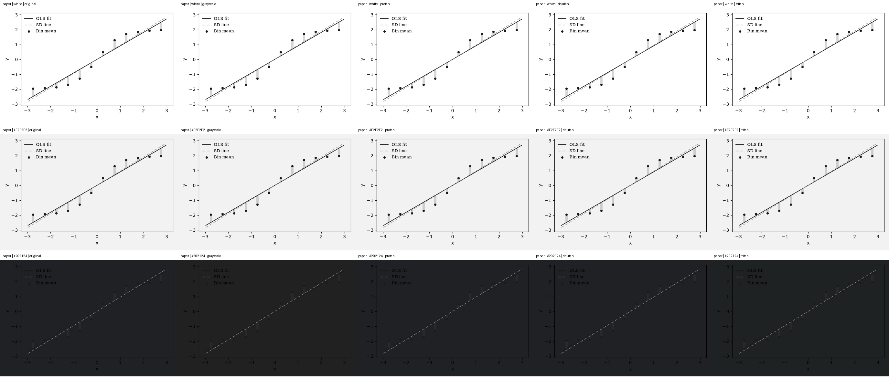
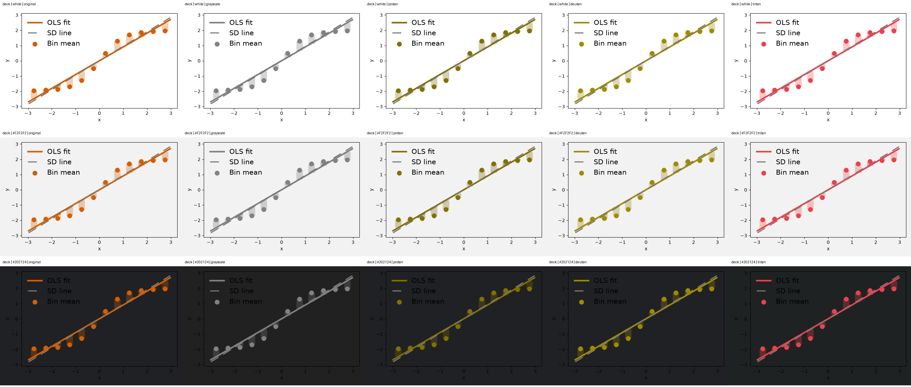

# Exporting figures and understanding visual limits

The D2 checks cover PNG, PDF and SVG output, caller axes, negative slopes,
missing/partially missing intervals, long labels and audit/facet layouts. Four
small raster baselines monitor default, paper, audit and standalone-deviation
composition. These are development checks; maintainer visual acceptance remains
pending, and they do not certify all layouts, viewers, printers or accessibility.

## Choose size, labels and background explicitly

```python
import numpy as np
import matplotlib.pyplot as plt
import binspect

x = np.linspace(-3, 3, 1200)
result = binspect.binscatter(x=x, y=-2 * np.tanh(x) + 0.35 * np.sin(23 * x), bins=12)
fig, ax = plt.subplots(figsize=(9, 5))
fig.set_facecolor("white")
ax.set_facecolor("white")
assert (
    result.plot(
        ax=ax,
        theme="paper",
        show=("bins", "ci", "fit", "sd_line"),
        annotate=None,
    )
    is ax
)
ax.set_xlabel("Exposure over the preceding observation period")
ax.set_ylabel("Average response across the measured outcome period")
ax.legend(handlelength=4)
fig.tight_layout()
for extension in ("png", "pdf", "svg"):
    fig.savefig(
        f"negative-fit.{extension}", dpi=150, facecolor="white", transparent=False
    )
plt.close(fig)
```

For caller-owned axes, binspect preserves figure size; it cannot choose a canvas
that fits every label. Use a suitable size and layout, wrap unusually long labels,
and inspect the saved file at its intended display size. `bbox_inches='tight'`
can include surrounding text but also changes the output dimensions. It is not a
substitute for arranging overlapping panels. The tests check labels on the actual
canvas and parse vector page dimensions/text.

PNG baselines use Agg, 100 dpi, CPython 3.12, Matplotlib 3.11.1, FreeType 2.14.3,
NumPy 2.5.2, SciPy 1.18.1, Pillow 12.3.0 and hashed bundled DejaVu fonts. Local
baselines were generated on macOS arm64. Library/font versions matter for raster
comparison; see [Matplotlib's testing documentation](https://matplotlib.org/stable/api/testing_api.html).
PDF text/page parsing uses development-only pypdf; SVG structure/text is parsed
as XML. These checks do not compare vector rendering in every reader or promise
accessible tagged PDFs. PDF/SVG pixel equivalence remains unqualified.

## Grayscale and color-vision review

The sheets below use all three presets on white, light gray (`#F2F2F2`) and dark
(`#202124`) backgrounds. Each row shows the original, linear-luminance grayscale,
and severity-100 protan/deutan/tritan simulations. The latter apply the numerical
matrices from Machado, Oliveira and Fernandes (2009), DOI
[10.1109/TVCG.2009.113](https://doi.org/10.1109/TVCG.2009.113), checked against
[colorspacious' supplementary-data transcription](https://github.com/njsmith/colorspacious/blob/master/colorspacious/cvd.py),
in linear RGB before gamut clipping and sRGB encoding. Simulation is a review
aid, not evidence that every person with a color-vision deficiency can read a plot.

| Condition | Local observation / limit |
|---|---|
| White or light gray, original and simulated colors | Bin markers and principal curves remain visible in these synthetic examples. Faint CI/deviation/raw context needs inspection at final size. |
| Grayscale notebook/deck | Accent and neutral have similar luminance; distinction relies on geometry, dashes and labels. Near-coincident curves and short deck legend handles can obscure that distinction; use longer handles and sufficient space. |
| Grayscale paper | Main estimates remain distinct from the lighter SD/context marks in the inspected example; print/photocopy quality is not tested. |
| Dark figure/axes backgrounds | Unsupported with the existing presets: labels/legend text lose contrast, and paper estimates can disappear. |
| Transparent output placed on a dark surface | Not qualified; the same dark-background problem can arise. Prefer explicit opaque white backgrounds for these presets. |
| Small projected figures, custom fonts, unusual labels or printers | Not qualified by the four images or this review. Inspect the actual deliverable. |

The palette comments previously claimed that accents are always darker than
neutrals and that palette origin guarantees color-vision safety. The measurements
contradict that: notebook luminances are approximately 0.152/0.156, while deck's
accent is **lighter** than its neutral (0.222/0.195). Those claims were removed;
palette values and visual defaults did not change. Nominal palette-text contrast
ratios against the tested dark background are only about 1.08–1.14. This is a
diagnostic measurement, not a standards-conformance assessment.







Low-opacity residual/raw marks in the audit are intentionally faint. Do not infer
missing observations from barely visible context marks, or treat plot-area/line
length as the squared lack-of-fit statistic. Interval availability and estimates
remain available in [tables and evidence](exports.md).

## Reproduce and review

`make figures` checks the four committed PNGs with renderer/font guards and a
prespecified RGB RMS ceiling of 0.5 on the 0–255 scale. Dimensions and opacity
must match. Baseline hashes guard accidental changes; failures never regenerate
references. The initial local rerender matched every image exactly (RMS 0.0).
Structural/export tests run in the normal unit suite on the configured matrix;
a dedicated macos-15/uv-managed Python 3.12.14 CI job checks the pinned raster
environment. Managed Python supplies the macOS patch build missing from setup-python;
the [R2 comparison](https://github.com/joshuamyers22/binspect/actions/runs/34733407408)
passes locally and on that CI runner. This does not qualify every
host or replace maintainer visual acceptance.

To regenerate disposable simulation sheets, run
`uv run --frozen --all-extras python validation/figure_accessibility.py`.
Baseline replacement is a separate explicit review action; see the repository's
[baseline instructions](https://github.com/joshuamyers22/binspect/blob/main/tests/baseline/README.md).
No image threshold, statistical convention or assessment seed is adjusted by
these checks. Broader accessibility review and maintainer acceptance remain open.
