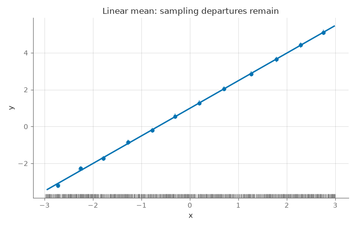
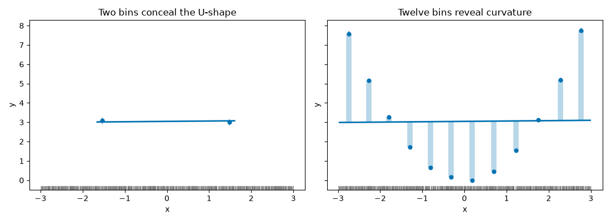
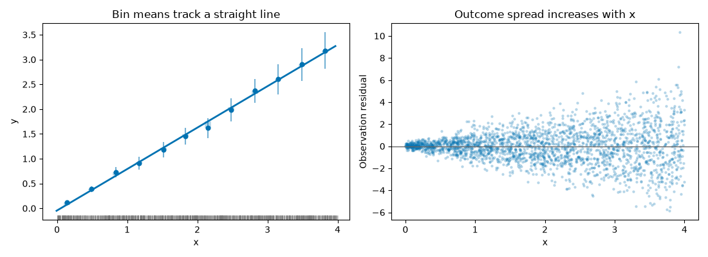
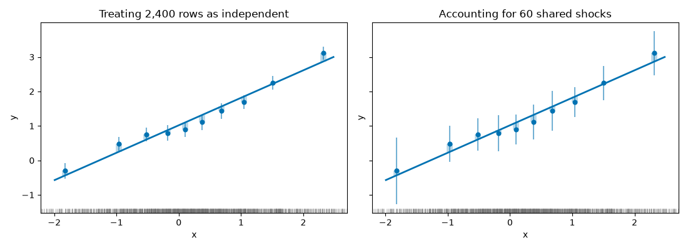
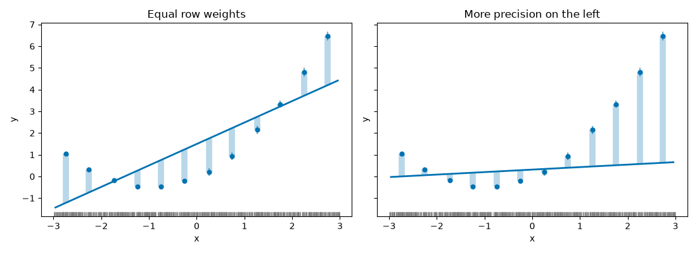
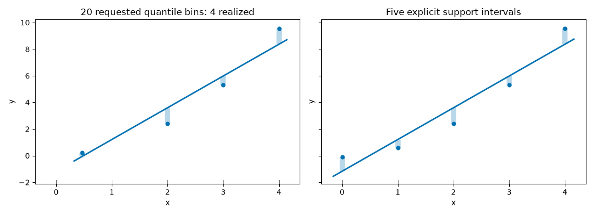
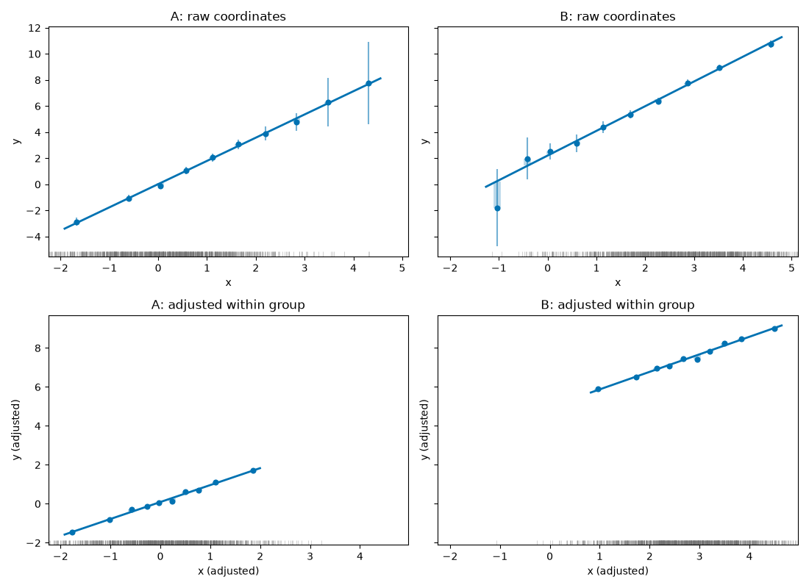

# Reproducible example gallery

These seven synthetic examples show what binned diagnostics can reveal and what
the same picture can hide. They describe the 0.2.2 API. Every
Python block on this page runs, in order, in the documentation check; each case
has its own PCG64 seed. No external dataset, download or optional statistical
backend is needed. The example code and generated synthetic figures use the
repository's MIT license.

From a checkout, retain all seven figures and a JSON manifest with:

```sh
uv sync --frozen --all-extras
uv run --frozen --all-extras python examples/gallery.py --output .work/gallery
```

The launcher executes this page's code in a fresh process. It records this page,
launcher and lock hashes alongside package/rendering versions, seeds, synthetic
input hashes, result hashes and selected statistics. The
[committed manifest](../assets/gallery/manifest.json) identifies the figures shown
here. Same-environment reproduction is checked; bitwise equality across numerical
libraries, fonts or operating systems is not promised. These fixed teaching
examples are neither selected from a seed search nor statistical coverage tests.

In the binned panels, blue points are bin means and the solid line is fitted to
observations. Thin bars show approximate 95% pointwise bin-mean intervals, conditional
on the observed partition; broad pale segments show signed departures from the line.
The rug marks x locations. Bars are not simultaneous bands or prediction intervals,
and their validity depends on the sampling assumptions discussed in each case.

## Shared setup

Run this setup once, then the case blocks in order. In a notebook, the files are
written to its current directory; the checkout launcher uses the requested output
directory. All input and result tables are Polars. When you need pandas, explicitly
call `result.to_pandas()` with the pandas extra installed; see
[table conversion](exports.md).

```python
import hashlib
import json
import platform
from importlib.metadata import version
from pathlib import Path

import matplotlib

matplotlib.use("Agg")
import matplotlib.pyplot as plt
import numpy as np
import polars as pl
from matplotlib import font_manager, ft2font

import binspect

plt.rcParams.update(
    {
        "figure.dpi": 100,
        "savefig.dpi": 100,
        "font.family": "DejaVu Sans",
        "text.usetex": False,
    }
)
SEEDS = dict(
    zip(
        [
            "linear",
            "nonlinear",
            "heteroskedastic",
            "clustered",
            "weighted",
            "discrete_x",
            "grouped_controls",
        ],
        range(120101, 120108),
        strict=True,
    )
)
report = {
    "schema_version": 1,
    "purpose": "synthetic teaching examples; not inference qualification",
    "rng": "numpy.random.PCG64",
    "python": platform.python_version(),
    "host": {"system": platform.system(), "machine": platform.machine()},
    "versions": {
        name: version(name)
        for name in [
            "binspect-regression",
            "numpy",
            "polars",
            "scipy",
            "matplotlib",
            "pillow",
        ]
    },
    "freetype": ft2font.__freetype_version__,
    "font_sha256": hashlib.sha256(
        Path(
            font_manager.findfont("DejaVu Sans", fallback_to_default=False)
        ).read_bytes()
    ).hexdigest(),
    "cases": {},
}


def stream(name):
    return np.random.Generator(np.random.PCG64(SEEDS[name]))


def save_case(name, frame, results, figure):
    assert isinstance(frame, pl.DataFrame)
    figure.tight_layout()
    path = Path(f"{name}.png")
    figure.savefig(path, dpi=100, facecolor="white")
    plt.close(figure)
    summaries = {}
    for label, result in results.items():
        assert isinstance(result.table, pl.DataFrame)
        summaries[label] = {
            "slope": float(result.fit.slope),
            "gap": float(result.decomposition.gap),
            "n_bins": int(result.n_bins),
            "smallest_bin_rows": int(result.estimates.n.min()),
            "finite_bin_intervals": int(np.isfinite(result.estimates.ci_lo).sum()),
            "result_sha256": hashlib.sha256(result.to_json().encode()).hexdigest(),
        }
    report["cases"][name] = {
        "seed": SEEDS[name],
        "rows": frame.height,
        "input_sha256": hashlib.sha256(frame.write_json().encode()).hexdigest(),
        "figure_sha256": hashlib.sha256(path.read_bytes()).hexdigest(),
        "results": summaries,
    }
```

## Linear: noise around the correct mean

Seed **120101** generates 2,400 independent observations with
`y = 1 + 1.5*x + Normal(0, 1)` and uniform x on [-3, 3]. Bin means approximately
follow the line; their departures still fluctuate with sampling and partitioning.
A small descriptive gap cannot certify linearity, rule out omitted variables or
establish a causal effect. The intervals concern bin means, not individual outcomes.

```python
rng = stream("linear")
x = rng.uniform(-3, 3, 2400)
frame = pl.DataFrame({"x": x, "y": 1 + 1.5 * x + rng.normal(size=x.size)})
result = binspect.binscatter(frame, x="x", y="y", bins=12)
ax = result.plot(annotate=None, title="Linear mean: sampling departures remain")
assert np.isclose(result.fit.slope, np.polyfit(x, frame["y"].to_numpy(), 1)[0])
save_case("linear", frame, {"linear": result}, ax.figure)
```



## Nonlinear: coarse bins can hide curvature

Seed **120102** uses `y = x**2 + Normal(0, 0.6)` with uniform x on [-3, 3].
Two broad bins average over the U-shape; twelve bins reveal it. Both panels use the
same observations and the same observation-level fitted line. Changing bins
changes the diagnostic, not that line. A near-flat line or a reassuring two-bin
picture does not imply that y is unrelated to x. Neither gap is a p-value.

```python
rng = stream("nonlinear")
x = rng.uniform(-3, 3, 2400)
frame = pl.DataFrame({"x": x, "y": x**2 + rng.normal(scale=0.6, size=x.size)})
coarse = binspect.binscatter(frame, x="x", y="y", bins=2)
fine = binspect.binscatter(frame, x="x", y="y", bins=12)
fig, axes = plt.subplots(1, 2, figsize=(11, 4), sharex=True, sharey=True)
coarse.plot(ax=axes[0], annotate=None, title="Two bins conceal the U-shape")
fine.plot(ax=axes[1], annotate=None, title="Twelve bins reveal curvature")
assert np.isclose(coarse.fit.slope, fine.fit.slope)
assert fine.decomposition.gap > coarse.decomposition.gap
save_case("nonlinear", frame, {"coarse": coarse, "fine": fine}, fig)
```



## Heteroskedastic: mean fit and outcome spread differ

Seed **120103** uses uniform x on [0, 4], mean `0.8*x`, and independent normal
noise with SD `0.15 + 0.6*x`. The means look approximately linear while the raw
residual spread grows sharply. Narrow mean intervals are not narrow prediction
intervals. The default classical slope covariance does not account for this
variance pattern; `binscatter` has no HC1 option. This picture is descriptive,
not evidence that the default slope uncertainty is valid under heteroskedasticity.

```python
rng = stream("heteroskedastic")
x = rng.uniform(0, 4, 2400)
sigma = 0.15 + 0.6 * x
frame = pl.DataFrame({"x": x, "y": 0.8 * x + sigma * rng.normal(size=x.size)})
result = binspect.binscatter(frame, x="x", y="y", bins=12)
fig, axes = plt.subplots(1, 2, figsize=(11, 4))
result.plot(ax=axes[0], annotate=None, title="Bin means track a straight line")
residual = result.y - result.fit.predict(result.x)
axes[1].scatter(result.x, residual, s=5, alpha=0.2, color="#0072B2")
axes[1].axhline(0, color="#666666", linewidth=1)
axes[1].set(
    xlabel="x", ylabel="Observation residual", title="Outcome spread increases with x"
)
for ax in axes:
    ax.set_xticks(np.arange(5))
assert np.std(residual[x > 3]) > np.std(residual[x < 1])
save_case("heteroskedastic", frame, {"descriptive": result}, fig)
```



## Clustered: rows are not independent information

Seed **120104** generates 60 clusters with 40 rows each. Each cluster shares an x
location and an outcome shock; row-level x and noise also vary independently.
`y = 1 + 0.8*x + cluster_shock + row_noise`. The same point estimates appear with
independent and CR1 clustered intervals, but the uncertainty differs. This balanced
example demonstrates the covariance choice; 60 is not a universal safe threshold.
Few/uneven clusters can severely undercover, and interval width need not increase
in every sample or bin. Read [cluster limitations](weights.md).

```python
rng = stream("clustered")
cluster = np.repeat(np.arange(60), 40)
x = np.repeat(rng.normal(size=60), 40) + rng.normal(scale=0.6, size=2400)
shock = np.repeat(rng.normal(scale=1.4, size=60), 40)
frame = pl.DataFrame(
    {"x": x, "y": 1 + 0.8 * x + shock + rng.normal(size=2400), "cluster": cluster}
)
independent = binspect.binscatter(frame, x="x", y="y", bins=10)
clustered = binspect.binscatter(frame, x="x", y="y", bins=10, cluster="cluster")
fig, axes = plt.subplots(1, 2, figsize=(11, 4), sharex=True, sharey=True)
independent.plot(ax=axes[0], annotate=None, title="Treating 2,400 rows as independent")
clustered.plot(ax=axes[1], annotate=None, title="Accounting for 60 shared shocks")
np.testing.assert_allclose(independent.estimates.y_mean, clustered.estimates.y_mean)
assert np.isclose(independent.fit.slope, clustered.fit.slope)
assert clustered.verdict == "not assessed"
save_case("clustered", frame, {"independent": independent, "CR1": clustered}, fig)
```



## Weighted: precision weights can change the projection

Seed **120105** uses uniform x on [-3, 3], curved mean `x + 0.5*x**2`, and normal
noise with SD 0.3 at x <= 0 and 1.3 at x > 0. The known inverse noise variances are
used as positive reliability weights. Both panels use the same fixed edges, but
the weighted line gives more influence to the left side. With a curved mean,
there is no single common slope that weighting must recover. Weights are not
automatic bias correction or a survey-design implementation; inverse noise
variance alone does not repair a misspecified linear mean's slope inference.

```python
rng = stream("weighted")
x = rng.uniform(-3, 3, 2400)
sigma = np.where(x <= 0, 0.3, 1.3)
frame = pl.DataFrame(
    {
        "x": x,
        "y": x + 0.5 * x**2 + sigma * rng.normal(size=x.size),
        "precision": 1 / sigma**2,
    }
)
edges = np.linspace(-3, 3, 13)
ordinary = binspect.binscatter(frame, x="x", y="y", bins=edges)
weighted = binspect.binscatter(frame, x="x", y="y", bins=edges, weights="precision")
fig, axes = plt.subplots(1, 2, figsize=(11, 4), sharex=True, sharey=True)
ordinary.plot(ax=axes[0], annotate=None, title="Equal row weights")
weighted.plot(ax=axes[1], annotate=None, title="More precision on the left")
design = np.column_stack([np.ones(x.size), x])
root_w = np.sqrt(frame["precision"].to_numpy())
reference = np.linalg.lstsq(
    design * root_w[:, None], frame["y"].to_numpy() * root_w, rcond=None
)[0]
assert np.isclose(weighted.fit.slope, reference[1])
np.testing.assert_allclose(
    ordinary.binning.partition_edges, weighted.binning.partition_edges
)
save_case("weighted", frame, {"ordinary": ordinary, "weighted": weighted}, fig)
```



## Discrete x: requested bins are not new support

Seed **120106** draws x uniformly from the five integer values 0–4 and uses
`y = 0.6*x**2 + Normal(0, 0.8)`. Asking for 20 quantile bins cannot create 20
distinct x values; tied edges are merged. Explicit half-integer edges put one
support value in each interval. Check realized counts and interval bounds rather
than interpreting the requested bin count as precision. Lines connecting sparse
support are visual guides, not estimates at every point between observed values.
This seed produces four realized quantile bins and a visible `BinCountWarning`;
the two lowest support values share an interval in that partition.

```python
rng = stream("discrete_x")
x = rng.integers(0, 5, 1200)
frame = pl.DataFrame({"x": x, "y": 0.6 * x**2 + rng.normal(scale=0.8, size=x.size)})
requested = binspect.binscatter(frame, x="x", y="y", bins=20)
explicit = binspect.binscatter(frame, x="x", y="y", bins=np.arange(-0.5, 5, 1))
fig, axes = plt.subplots(1, 2, figsize=(11, 4), sharex=True, sharey=True)
requested.plot(
    ax=axes[0],
    annotate=None,
    title=f"20 requested quantile bins: {requested.n_bins} realized",
)
explicit.plot(ax=axes[1], annotate=None, title="Five explicit support intervals")
assert requested.n_bins <= frame["x"].n_unique()
assert explicit.n_bins == 5
np.testing.assert_array_equal(explicit.estimates.x_mean, np.arange(5))
save_case("discrete_x", frame, {"quantile": requested, "explicit": explicit}, fig)
```



## Grouped controls: adjustment changes the coordinates

Seed **120107** creates 1,200 rows in each of groups A and B. Writing g=0 for A
and g=1 for B, `z = g + Normal(0, 1)`, `x = 2*g + 0.8*z + Normal(0, 1)`, and
`y = 0.9*x + 2*z + 3*g + Normal(0, 1)`. The top row compares raw groups with
shared intervals. The bottom row adjusts for z separately within each group;
the fitted x coefficients match full within-group OLS designs.

Each adjusted group restores its own means and uses its own bins. The remaining
horizontal/vertical separation is not an adjusted group effect, and adjusted bin
IDs cannot be joined as matching intervals. Shared bins with controls are rejected.
Adjusted bins are descriptive: SEs/CIs are unavailable, so `ci=None` is deliberate.
FWL coefficient agreement does not establish causal identification. See
[adjustment](adjustment.md) and [group partitions](groups.md).
Shared raw bins can also have sparse group-specific tails: this example emits a
small-bin warning for an interval with only two rows. A shared partition does not
guarantee adequate support within each group; the manifest records minimum counts.

```python
rng = stream("grouped_controls")
g = np.repeat([0, 1], 1200)
z = g + rng.normal(size=2400)
x = 2 * g + 0.8 * z + rng.normal(size=2400)
frame = pl.DataFrame(
    {
        "x": x,
        "y": 0.9 * x + 2 * z + 3 * g + rng.normal(size=2400),
        "z": z,
        "group": np.where(g == 0, "A", "B"),
    }
)
raw = binspect.compare(frame, x="x", y="y", group="group", bins=10)
adjusted = binspect.compare(
    frame,
    x="x",
    y="y",
    group="group",
    bins=10,
    controls="z",
    common_bins=False,
    ci=None,
)
fig, axes = plt.subplots(2, 2, figsize=(11, 8), sharex="row", sharey="row")
results = {}
for column, label in enumerate(["A", "B"]):
    before, after = raw.results[label], adjusted.results[label]
    before.plot(ax=axes[0, column], annotate=None, title=f"{label}: raw coordinates")
    after.plot(
        ax=axes[1, column], annotate=None, title=f"{label}: adjusted within group"
    )
    subset = frame.filter(pl.col("group") == label)
    design = np.column_stack([np.ones(subset.height), subset["z"], subset["x"]])
    coefficient = np.linalg.lstsq(design, subset["y"].to_numpy(), rcond=None)[0][-1]
    assert np.isclose(after.fit.slope, coefficient)
    assert np.isnan(after.estimates.se).all()
    assert np.isnan(after.estimates.ci_lo).all()
    results[f"raw_{label}"] = before
    results[f"adjusted_{label}"] = after
save_case("grouped_controls", frame, results, fig)
```



## Save the reproduction record

The final block writes the compact numerical and rendering record. The checkout
launcher adds source/lock hashes; code copied into a notebook records its actual
environment but cannot identify the notebook's source automatically. Raw synthetic
rows are regenerated from the code and seeds rather than bundled.

```python
assert set(report["cases"]) == set(SEEDS)
Path("manifest.json").write_text(json.dumps(report, indent=2, sort_keys=True) + "\n")
```

The figures use opaque white backgrounds. Their role is teaching, separate from
the four [D2 rendering regression baselines and visual limits](figure-exports.md).
No single gallery picture validates interval coverage, a diagnostic threshold,
print accessibility or capacity on larger workloads.
